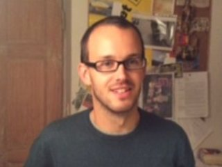

<h2>About me</h2>

I'm Adam Liska, a graduate student at the [Functional Neuroimaging
Lab](http://cncs.iit.it/research-labs/mri.html) of Center for Neuroscience and
Cognitive Systems (Istituto Italiano di Tecnologia) in 
Rovereto, Italy 
([map](https://www.google.com/maps/place/Roveret://www.google.com/maps/place/38068+Rovereto+TN,+It%C3%A1lie/@47.2603133,11.7074777,5z/data=!4m2!3m1!1s0x47820ec143127041:0x6a9664123aebfadf)).

I'm interested in medical imaging and data analysis, and I'm currently 
involved in implementing structural and functional Magnetic Resonance Imaging 
methods to study the mouse brain (see [publications](/publications)).

I work under the supervision of [Alessandro Gozzi](http://cncs.iit.it/people/iit-unitn/researcher/alessandro-gozzi.html).

I did my BSc in Computer Science at Charles University in Prague, MSc in
Computer Science at The University of Melbourne, and MSc in Cognitive 
Science at Università degli Studi di Trento (see [theses](/publications/#theses)).

<h2>Recent posts</h2>
<ul class="post-list">
    
        <li>
            {{ post.date | date: "%b %-d, %Y" }}
            <h2>
                <a class="post-link" href="{{ post.url | prepend: site.baseurl }}">{{ post.title }}</a>
            </h2>
            {{ post.excerpt }}
        </li>
    
</ul>
