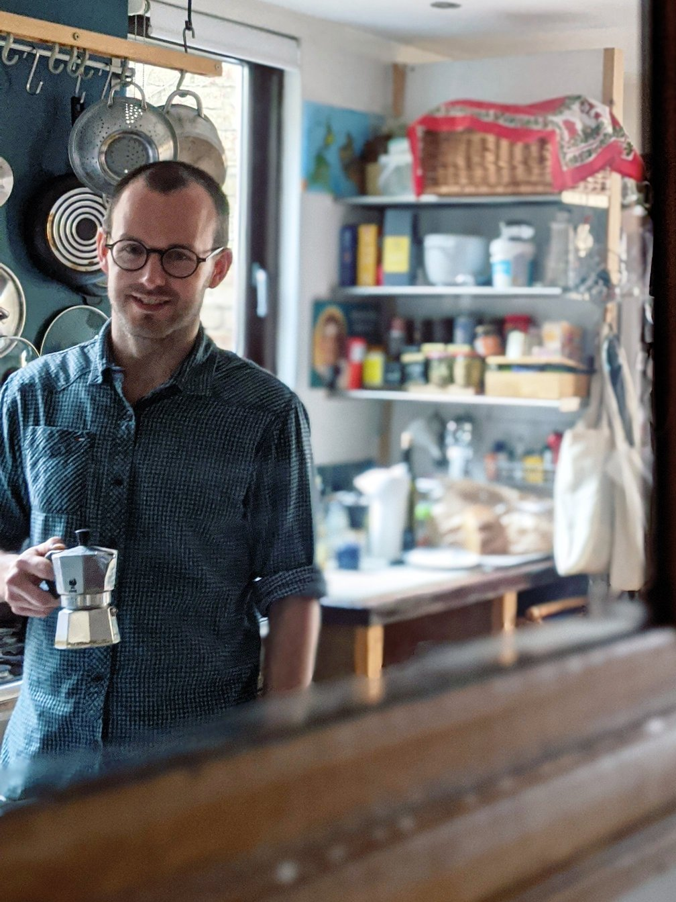

<h2>About me</h2>

I co-founded [Airspeed](https://goairspeed.com/) (formerly Glyphic), where I'm CEO. We're building the system of execution for revenue teams — connecting the full GTM stack and running autonomous agents that act on it. I spend most of my time thinking about how companies of the future will be run, and how people and AI can work well together.

Previously, I was a research engineer at DeepMind, focusing on machine learning
and natural language processing, and at Spotify, where I built machine 
learning products that enrich Spotify's audio catalog.

I completed my PhD in Brain and Cognitive Sciences at the [Functional Neuroimaging
Lab](https://www.iit.it/research/lines/functional-neuroimaging)
(Istituto Italiano di Tecnologia), working with
[Alessandro Gozzi](https://www.iit.it/people/alessandro-gozzi).
I did my BSc in Computer Science at Charles University in Prague working on
machine translation with [Ondřej Bojar](http://www1.cuni.cz/~obo/),
and my MSc in Computer and Cognitive Sciences at
The University of Melbourne and University of Trento
working on computer vision, distributional semantics and
machine learning with [Marco Baroni](https://marcobaroni.org/)
and [Elia Bruni](https://eliabruni.github.io/).
All my theses are [here](/publications/#theses).

<h2>Get in touch</h2>
[Twitter](https://twitter.com/adliska) - [Github](https://github.com/adliska) - 
[LinkedIn](https://www.linkedin.com/in/adliska/)
